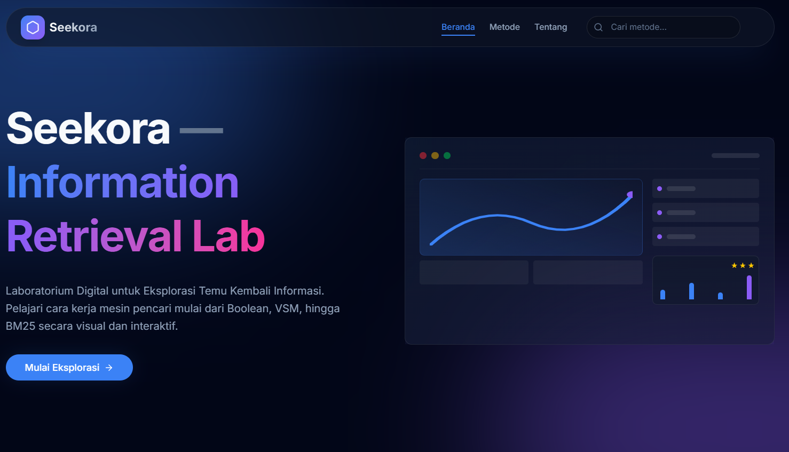

# Seekora: Advanced Information Retrieval System

**Seekora** adalah platform interaktif untuk mengeksplorasi dan mensimulasikan berbagai metode Temu Kembali Informasi (Information Retrieval/IR). Aplikasi ini memadukan antarmuka modern (Next.js) dengan backend analitik yang kuat (Python).



## 🚀 Fitur Utama

Aplikasi ini menyediakan simulasi visual untuk algoritma IR klasik dan modern:

1.  **Regex Search**: Pencarian pola teks presisi menggunakan Regular Expressions.
2.  **Boolean Retrieval**: Pencarian logika Boolean (AND, OR, NOT) dengan parser rekursif.
3.  **Vector Space Model (VSM)**: Perangkingan dokumen berbasis TF-IDF dan Cosine Similarity.
4.  **BM25 Ranking**: Algoritma probabilistik standar industri untuk pencarian teks.
5.  **Relevance Feedback**: Simulasi penyempurnaan query berdasarkan umpan balik pengguna.
6.  **Document Clustering**: Visualisasi pengelompokan dokumen otomatis menggunakan K-Means++.

---

## 🛠️ Arsitektur Teknologi

Sistem ini menggunakan arsitektur **Hybrid**:

### **Frontend (Next.js 14)**
*   **Framework**: Next.js (App Router)
*   **Styling**: Tailwind CSS + clsx
*   **Icons**: Lucide React
*   **Bahasa**: TypeScript

### **Backend (Python Flask)**
*   **Framework**: Flask
*   **NLP Library**: Sastrawi (Stemming Bahasa Indonesia) & Scikit-learn
*   **Algorithms**: TF-IDF, K-Means, BM25 (via `rank-bm25`)
*   **Optimasi**: LRU Caching untuk akselerasi stemming.

---

## 📦 Instalasi & Menjalankan Aplikasi

Aplikasi ini membutuhkan dua terminal yang berjalan bersamaan: satu untuk Frontend dan satu untuk Backend.

### Prasyarat
*   Node.js (v18+)
*   Python (v3.10+)

### 1. Setup Backend (Python)
Backend menangani logika berat seperti stemming dan perhitungan vektor.

```bash
cd backend
pip install -r requirements.txt
python app.py
```
*Server akan berjalan di http://localhost:5000*

> **Catatan Performa**: Request pertama mungkin terasa sedikit lambat (beberapa detik) karena inisialisasi cache Stemmer. Request selanjutnya akan sangat cepat (<100ms).

### 2. Setup Frontend (Next.js)
Frontend menangani antarmuka pengguna.

```bash
# Di terminal baru (root folder project)
npm install
npm run dev
```
*Aplikasi bisa diakses di http://localhost:3000*

---

## 📂 Struktur Project

```
root/seekora/
├── backend/            # Logika Python & Flask
│   ├── app.py          # Entry point server Flask
│   ├── ir_methods.py   # Implementasi algoritma (VSM, BM25, dll)
│   └── requirements.txt
├── src/
│   ├── app/            # Halaman Next.js (method pages)
│   ├── actions/        # Server Actions (penghubung ke Backend)
│   └── components/     # Komponen UI Reusable
└── public/             # Aset statis
```

## 📝 Catatan Pengembang
*   **Stemming**: Menggunakan library `Sastrawi` yang telah di-cache (`@lru_cache`) untuk performa maksimal.
*   **Migration**: Backend sebelumnya (TypeScript) telah sepenuhnya digantikan oleh Python untuk akurasi yang lebih baik pada teks Bahasa Indonesia.

---
*Dibuat untuk tugas Sistem Temu Kembali Informasi.*
